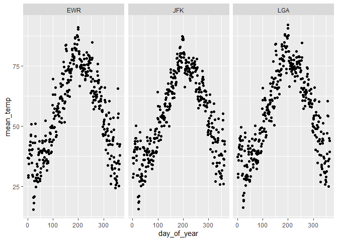

Practice Exam
=============

This practice exam asks you to do several code wrangling tasks that we
have done in class so far.

Clone this repo into Rstudio and fill in the necessary code. Then,
commit and push to github. Finally, turn in a link to canvas.

    ## Warning: package 'tidyverse' was built under R version 3.5.3

    ## -- Attaching packages ------------------------------------------------------------------------- tidyverse 1.3.0 --

    ## v ggplot2 3.2.1     v purrr   0.3.3
    ## v tibble  2.1.3     v dplyr   0.8.3
    ## v tidyr   1.0.0     v stringr 1.4.0
    ## v readr   1.3.1     v forcats 0.4.0

    ## Warning: package 'ggplot2' was built under R version 3.5.3

    ## Warning: package 'tibble' was built under R version 3.5.3

    ## Warning: package 'tidyr' was built under R version 3.5.3

    ## Warning: package 'readr' was built under R version 3.5.3

    ## Warning: package 'purrr' was built under R version 3.5.3

    ## Warning: package 'dplyr' was built under R version 3.5.3

    ## Warning: package 'stringr' was built under R version 3.5.3

    ## Warning: package 'forcats' was built under R version 3.5.3

    ## -- Conflicts ---------------------------------------------------------------------------- tidyverse_conflicts() --
    ## x dplyr::filter() masks stats::filter()
    ## x dplyr::lag()    masks stats::lag()

Make a plot with three facets, one for each airport in the weather data.
The x-axis should be the day of the year (1:365) and the y-axis should
be the mean temperature recorded on that day, at that airport.

    library(lubridate)

    ## Warning: package 'lubridate' was built under R version 3.5.3

    ## 
    ## Attaching package: 'lubridate'

    ## The following object is masked from 'package:base':
    ## 
    ##     date

    weather %>% 
      mutate(day_of_year = yday(time_hour)) %>% 
      group_by(origin,day_of_year) %>%
      summarize(mean_temp = mean(temp)) %>% 
      ggplot() +
      geom_point(mapping = aes(x = day_of_year, y = mean_temp)) +
      facet_grid(.~origin)

    ## Warning: Removed 1 rows containing missing values (geom_point).

Make a non-tidy matrix of that data where each row is an airport and
each column is a day of the year.

    weather %>% 
      mutate(day_of_year = yday(time_hour)) %>% 
      group_by(origin, day_of_year) %>% 
      summarize(ave.temp = mean(temp, na.rm = T)) %>% 
      pivot_wider(names_from = day_of_year, values_from = ave.temp)

    ## # A tibble: 3 x 365
    ## # Groups:   origin [3]
    ##   origin   `1`   `2`   `3`   `4`   `5`   `6`   `7`   `8`   `9`  `10`  `11`
    ##   <chr>  <dbl> <dbl> <dbl> <dbl> <dbl> <dbl> <dbl> <dbl> <dbl> <dbl> <dbl>
    ## 1 EWR     36.8  28.7  29.6  34.3  36.6  39.9  40.3  38.6  42.1  43.6  42.0
    ## 2 JFK     36.9  28.6  30.1  34.7  36.8  39.3  40.1  39.4  42.7  43.6  41.3
    ## 3 LGA     37.2  28.8  30.3  35.8  38.3  41.0  41.4  42.3  44.9  44.3  40.3
    ## # ... with 353 more variables: `12` <dbl>, `13` <dbl>, `14` <dbl>,
    ## #   `15` <dbl>, `16` <dbl>, `17` <dbl>, `18` <dbl>, `19` <dbl>,
    ## #   `20` <dbl>, `21` <dbl>, `22` <dbl>, `23` <dbl>, `24` <dbl>,
    ## #   `25` <dbl>, `26` <dbl>, `27` <dbl>, `28` <dbl>, `29` <dbl>,
    ## #   `30` <dbl>, `31` <dbl>, `32` <dbl>, `33` <dbl>, `34` <dbl>,
    ## #   `35` <dbl>, `36` <dbl>, `37` <dbl>, `38` <dbl>, `39` <dbl>,
    ## #   `40` <dbl>, `41` <dbl>, `42` <dbl>, `43` <dbl>, `44` <dbl>,
    ## #   `45` <dbl>, `46` <dbl>, `47` <dbl>, `48` <dbl>, `49` <dbl>,
    ## #   `50` <dbl>, `51` <dbl>, `52` <dbl>, `53` <dbl>, `54` <dbl>,
    ## #   `55` <dbl>, `56` <dbl>, `57` <dbl>, `58` <dbl>, `59` <dbl>,
    ## #   `60` <dbl>, `61` <dbl>, `62` <dbl>, `63` <dbl>, `64` <dbl>,
    ## #   `65` <dbl>, `66` <dbl>, `67` <dbl>, `68` <dbl>, `69` <dbl>,
    ## #   `70` <dbl>, `71` <dbl>, `72` <dbl>, `73` <dbl>, `74` <dbl>,
    ## #   `75` <dbl>, `76` <dbl>, `77` <dbl>, `78` <dbl>, `79` <dbl>,
    ## #   `80` <dbl>, `81` <dbl>, `82` <dbl>, `83` <dbl>, `84` <dbl>,
    ## #   `85` <dbl>, `86` <dbl>, `87` <dbl>, `88` <dbl>, `89` <dbl>,
    ## #   `90` <dbl>, `91` <dbl>, `92` <dbl>, `93` <dbl>, `94` <dbl>,
    ## #   `95` <dbl>, `96` <dbl>, `97` <dbl>, `98` <dbl>, `99` <dbl>,
    ## #   `100` <dbl>, `101` <dbl>, `102` <dbl>, `103` <dbl>, `104` <dbl>,
    ## #   `105` <dbl>, `106` <dbl>, `107` <dbl>, `108` <dbl>, `109` <dbl>,
    ## #   `110` <dbl>, `111` <dbl>, ...

For each (airport, day) contruct a tidy data set of the airport's
"performance" as the proportion of flights that departed less than an
hour late.

    performance.dat <- flights %>% 
      mutate(day_of_year = yday(time_hour)) %>% 
      group_by(origin, day_of_year) %>%
      summarize(performance = mean(dep_delay < 60, na.rm = T))

Construct a tidy data set to that give weather summaries for each
(airport, day). Use the total precipitation, minimum visibility, maximum
wind\_gust, and average wind\_speed.

    weather.dat <- weather %>% 
      mutate(day_of_year = yday(time_hour)) %>% 
      group_by(origin, day_of_year) %>% 
      summarize(total.precitipitation = sum(precip,na.rm = T),
                minimum.visibility = min(visib),
                average.wind_speed = mean(wind_speed,na.rm = T))

Construct a linear model to predict the performance of each
(airport,day) using the weather summaries and a "fixed effect" for each
airport. Display the summaries.

    dat <- left_join(weather.dat, performance.dat)

    ## Joining, by = c("origin", "day_of_year")

    m <- lm(performance ~ total.precitipitation + minimum.visibility + average.wind_speed, data = dat)
    summary(m)

    ## 
    ## Call:
    ## lm(formula = performance ~ total.precitipitation + minimum.visibility + 
    ##     average.wind_speed, data = dat)
    ## 
    ## Residuals:
    ##      Min       1Q   Median       3Q      Max 
    ## -0.45210 -0.01932  0.01917  0.03762  0.18095 
    ## 
    ## Coefficients:
    ##                         Estimate Std. Error t value Pr(>|t|)    
    ## (Intercept)            0.8710870  0.0079301 109.845  < 2e-16 ***
    ## total.precitipitation -0.0553110  0.0078249  -7.069 2.79e-12 ***
    ## minimum.visibility     0.0080092  0.0007011  11.424  < 2e-16 ***
    ## average.wind_speed    -0.0006661  0.0005108  -1.304    0.193    
    ## ---
    ## Signif. codes:  0 '***' 0.001 '**' 0.01 '*' 0.05 '.' 0.1 ' ' 1
    ## 
    ## Residual standard error: 0.07039 on 1088 degrees of freedom
    ## Multiple R-squared:  0.2393, Adjusted R-squared:  0.2372 
    ## F-statistic: 114.1 on 3 and 1088 DF,  p-value: < 2.2e-16

Repeat the above, but only for EWR. Obviously, exclude the fixed effect
for each airport.

    dat.EWR <- dat %>% filter(origin == "EWR")
    m.EWR <- lm(performance ~ total.precitipitation + minimum.visibility + average.wind_speed, data = dat.EWR)
    summary(m.EWR)

    ## 
    ## Call:
    ## lm(formula = performance ~ total.precitipitation + minimum.visibility + 
    ##     average.wind_speed, data = dat.EWR)
    ## 
    ## Residuals:
    ##      Min       1Q   Median       3Q      Max 
    ## -0.32733 -0.03119  0.02363  0.04566  0.18642 
    ## 
    ## Coefficients:
    ##                         Estimate Std. Error t value Pr(>|t|)    
    ## (Intercept)            0.8658870  0.0134506  64.375  < 2e-16 ***
    ## total.precitipitation -0.0512542  0.0133869  -3.829 0.000152 ***
    ## minimum.visibility     0.0086600  0.0013316   6.504 2.62e-10 ***
    ## average.wind_speed    -0.0020805  0.0008928  -2.330 0.020341 *  
    ## ---
    ## Signif. codes:  0 '***' 0.001 '**' 0.01 '*' 0.05 '.' 0.1 ' ' 1
    ## 
    ## Residual standard error: 0.07406 on 360 degrees of freedom
    ## Multiple R-squared:  0.2366, Adjusted R-squared:  0.2302 
    ## F-statistic: 37.19 on 3 and 360 DF,  p-value: < 2.2e-16
